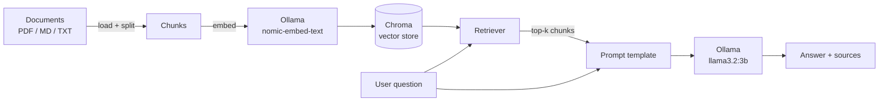

# Architecture

## Overview

## Ingestion pipeline (`app/rag/ingest.py`)

1. **Load** — every `.pdf`, `.md`, and `.txt` file under `data/sample_docs/`
   is loaded into LangChain `Document` objects via `PyPDFLoader` or
   `TextLoader`.
2. **Split** — documents are split into ~800-character chunks with 120
   characters of overlap (`RecursiveCharacterTextSplitter`), so context isn't
   cut mid-sentence at retrieval time.
3. **Embed & store** — each chunk is embedded with `nomic-embed-text` (served
   locally by Ollama) and persisted to a Chroma collection on disk.

Re-running ingestion (via `python3 -m app.rag.ingest` or `POST /api/ingest`)
rebuilds the index from scratch, which is simple and sufficient for the
document volumes this project targets.

## Query pipeline (`app/rag/chain.py`)

1. The vector store's retriever performs a similarity search for the top `k`
   (default 4) chunks most relevant to the question.
2. Retrieved chunks are joined into a single context block and inserted into
   a system prompt that explicitly instructs the model to answer **only**
   from the provided context, and to say it doesn't know rather than
   hallucinate.
3. The question and context are sent to `llama3.2:3b` via `ChatOllama`, and
   the response is parsed to a plain string.
4. The API layer separately returns the retrieved source chunks alongside the
   answer, so the caller can show provenance (which document/section the
   answer came from).

## Why these design choices

- **Local-only stack**: no API keys, no per-token cost, and no document
  content leaves the machine — relevant for privacy-sensitive use cases.
- **Chroma over a managed vector DB**: zero infrastructure to run this
  end-to-end on a laptop; trivially swappable for a hosted store (e.g.
  pgvector, Pinecone) if the project needed to scale past a single machine.
- **Chain caching (`lru_cache`)**: the retriever and LLM client are expensive
  to construct (model load, DB connection); caching avoids redoing that work
  on every chat request.
- **Explicit source attribution**: returning the raw retrieved chunks (not
  just the generated answer) makes it possible to verify the model didn't
  fabricate an answer, which matters for any real-world Q&A use case.

## Known limitations / next steps

- Ingestion is full-rebuild only; a production version would support
  incremental updates (add/remove individual documents without reprocessing
  everything).
- No conversation memory — each question is answered independently. Adding
  chat history would require passing prior turns into the prompt and
  managing context-window limits.
- Retrieval is pure vector similarity; a production system might add a
  re-ranking step or hybrid (keyword + vector) search for higher precision.
